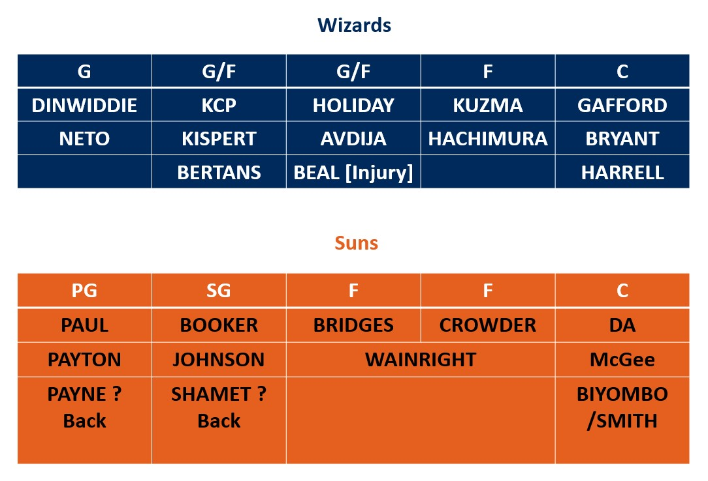

```{r setup, include=FALSE} 
knitr::opts_chunk$set(warning = FALSE, message = FALSE,echo = FALSE) 
```


# Possible Lineup

## Injury Condition

Suns injury players who might not out for the game include: Cameron Payne, Jae Crowder, Deandre Ayton, JaVale McGee, Abdel Nader11, Dario Saric, and Frank Kaminsky. 

All Wizards players currently can play the game.

## Rotation Matchup

```{r fig.align="center", echo=FALSE,out.width='100%'}


```
Due to the injury, Wizards have more bench support. In addition, most bench players are front court, so it would be an interesting night to see whether two Suns excellent guards can punish the mismatch.   

# Heatmap

## Shot Attempts Heatmap

```{r fig.align="center", echo=FALSE,out.width='100%'}


```
Deeper color shows more frequent attempts.

Basically, two teams have similar shot attempts distribution around three points line, corner and wings. Wizards have more attempts on the paint area, especially the restricted area. Therefore, guarding inside is important to win the games.   

```{r fig.align="center", echo=FALSE,out.width='100%'}


```

```{r fig.align="center", echo=FALSE,out.width='100%'}

knitr::include_graphics('playerattempttwo.jpg')

```

```{r fig.align="center", echo=FALSE,out.width='100%'}

knitr::include_graphics('playerattemptthree.jpg')
```

```{r fig.align="center", echo=FALSE,out.width='100%'}

```
```{r fig.align="center", echo=FALSE,out.width='100%'}

```


## Field Goal Percentage VS League Average Heatmap

```{r fig.align="center", echo=FALSE,out.width='100%'}

```
Suns is good at mid-range, especially in the right side of the court, and there is not a specific blind spot around the three-points line. While the wizards is more proficient in left wing and corner three points than right wings. 

```{r fig.align="center", echo=FALSE,out.width='100%'}
knitr::include_graphics('playervsone.jpg')
```

```{r fig.align="center", echo=FALSE,out.width='100%'}

```

```{r fig.align="center", echo=FALSE,out.width='100%'}
knitr::include_graphics('playervsthree.jpg')
```

```{r fig.align="center", echo=FALSE,out.width='100%'}
knitr::include_graphics('playervsfour.jpg')
```

```{r fig.align="center", echo=FALSE,out.width='100%'}

```

## Heatmap Short Summary

It would be better to combine these two types of heat maps to have a better understanding of players' shot choice and efficiency.

Wizards Starting Lineup:

Dinwiddie, likes attacking the rim and two wings three-points, but overall his shot efficiency is not high. 

Kcp, take cares of his sweet points-left corner three.

Kuzma, he frequently starts attack from the middle, be careful around the free-throw line zone.

Beal, he is good at mid-range in different angle and left corner three, so it would better to push him to shot more long two points around left cornor.

Gafford, he is good at finish the basket in the restricted area. 

Wizards Bench Support:

Avdija, like Kuzma, he loves attacking in the middle and top three points is his sweet point.

Thomas Bryant, not like traditional center, he can make three points, especially on the top.

Hachimura, besides attacking the rim around the restricted area, take care of in the right wing three points and left mid-range jump shot.

Harrell, besides restricted area, he extended his shoot efficiency area to the left mid range and above the free throw line, so try to push him attack on the right.

Kispert, is good at finishing basket in the both corner three points and restricted area.

Bertans, frequently shots three points in the both left and right wings near the top, but the efficiency is not great. However, his three points in the both corners is much better the league average.   

Hopefully, there are some unexpected results that can help you better prepare for the game :).


```{r fig.align="center",echo=FALSE,out.width='100%'}

```
