```{r setup, include=FALSE} 
knitr::opts_chunk$set(warning = FALSE, message = FALSE,echo = FALSE) 
```

# Awards 

```{r echo=FALSE,out.width='200%'}
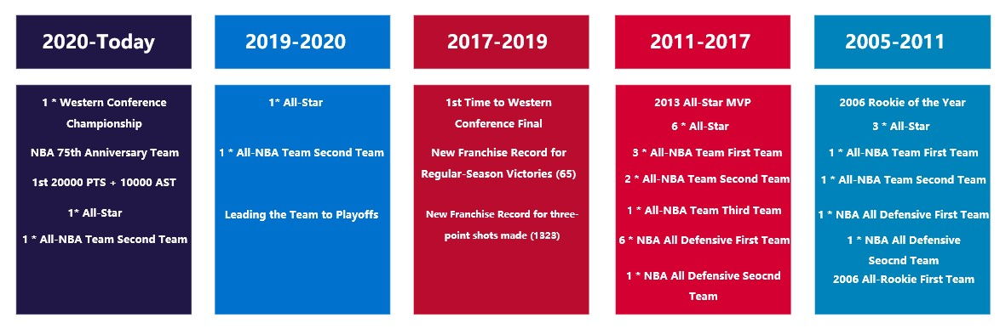
```

# Introduction


How time flies, Chris Paul currently fights for his 17th NBA seasons and already changed 5 different teams in the league. As you can see above, he won various awards and titles along the way to his final goal – Championship Ring. As a big fan of him since 2010, I would like to use two datasets [details could be found in About Section] to explore two questions related to offense, defense, and shot.

|    1.	How he changed his game style in different ages, teams, and game types?
|    2.	What are the keys of him to win the game? 
# Data Exploratory

## Offense

### Overall Field Goal Attempts & Field Goal Percentage

```{r out.width='100%'}
logactive$tm_order <- factor(logactive$Tm,levels=c('PHO','OKC','HOU','LAC','NOH','NOK'))

ggplot(logactive,aes(x=Result, y=FGA, fill=Seasontype)) + 
    geom_boxplot()+facet_wrap(~tm_order)+
  labs(
  title = 'Game Results  VS  Field Goal Attempts [2005-2021]', 
  x = 'Game Results', y = 'Field Goal Attempts')+
     theme(axis.text.x = element_text(size = 10),
           panel.grid.major=element_line(colour=NA),
          panel.background = element_rect(fill = "transparent",colour = NA),
          plot.background = element_rect(fill = "transparent",colour = NA),
          plot.title = element_text(color="black", size=12, face="bold.italic",
	                                vjust=3, hjust = 0.5),
           axis.title.x = element_text(color="black", size=10, face="bold",vjust=-1),
           axis.title.y = element_text(color="black", size=10, face="bold",vjust=4),
           panel.grid.minor = element_blank())+
  scale_fill_manual(values = c("playoffs" = '#484878',
                                "regular" = '#FC766A'))
```
Besides in NOK team, above graph shows that his field goal attempts in 16 seasons can be divided into two groups, one is PHO, HOU, and LAC, the other is OKC and NOH. In the first three teams, winning games are not dependent on his field goal attempts, especially in the regular season, his field goal attempts even become lower when he won the games. However, things are totally different in the other groups. He needs to shot more to win the games, especially in the playoffs season.       

```{r echo=FALSE,out.width='100%'}
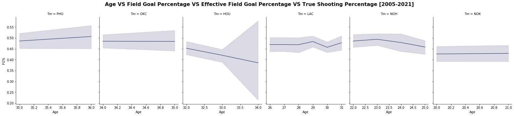
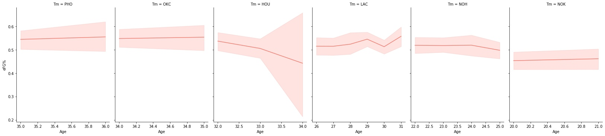
```
```{r echo=FALSE,out.width='100%'}
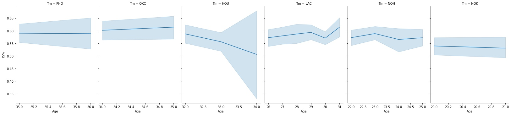
```

Above graph shows the relationship between age and three field goal percentage related stats. It was amazing to keep the field goal percentage related stats above 45% in most his 16 seasons. In addition, the value and variance of his shooting field goal percentage related stats became worse as he was required to extend the shot range and make more 3-points shot in HOU.    

```{r, echo=FALSE}
htmltools::includeHTML("fgavsfgp.html")
```

Above interactive graph shows the relationship between field goal attempts and field goal percentage. Almost every trend line shows that when he made more field goal attempts, he would have higher field goal percentage. When you filter the regular season and zoom in, you can notice that he needs fewer shot attempts to get 50% field goal percentage in recent two seasons, which fits with my expectation: make fewer shots but gain more points. When you select the playoffs season only, compared with other seasons, the slope of trend line in HOU is flatter, reflecting his field goal percentage are quite stable no matter how many field goal attempts. The reason behind that might be shot range extension and isolation possession growth.     

### 3-Points

```{r fig.align="center", echo=FALSE,out.width='100%'}

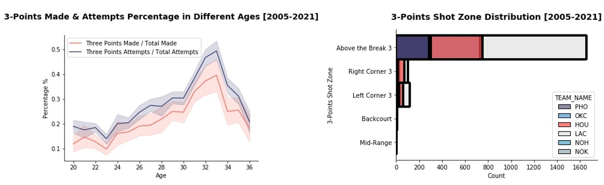
```
Left graph shows his 3-points made and attempts percentage in different ages. Both the 3-points made and attempts percentage increased since 23 and arrived its peak around 33, when he was in Houston Rockets, a team encouraged players to shot 3-points. In current two seasons, he started made less 3-points so two stats gradually returned to his 23-years old level.

Right graph shows his shot zone distribution and his 3-points shots are mainly concentrated on Above the Break Three, which is right 45-60 degrees 3-points area. Although his 3-points percentage continuously decreased after 2018-2019 season, his shot attempts are more concentrated. In addition, Compared with six seasons in LAC, he tried more 3-points shots in the right corner in the Houston Rockets during only two seasons. 

```{r, echo=FALSE}
htmltools::includeHTML("threepoints.html")
```

Above interactive graph show his 3-points shot distribution in a more detailed way. His 3-points shot attempts are concentrated on Above the Break 3. In the regular season, his Above the Break 3 shot attempts drop from 304.5 times per-season in Houston Rockets to 114.5 times per-season in Phoenix Suns. However, the number of Above the Break 3 shot made does not drop like that. Compared with Houston Rockets, he made only less 20 3-points shots in Above the Break 3 Area. 

Therefore, he is more efficient in dealing with 3-points shot in Above the Break 3 Area currently. This idea also applies in the playoffs season, his 3-points shot in Above the Break 3 Area increased from 34% [HOU] to 36% [OKC] to 43% [PHO] during last four seasons with less 3-points attempts.     

### Free Throw
```{r echo=FALSE,out.width='100%'}
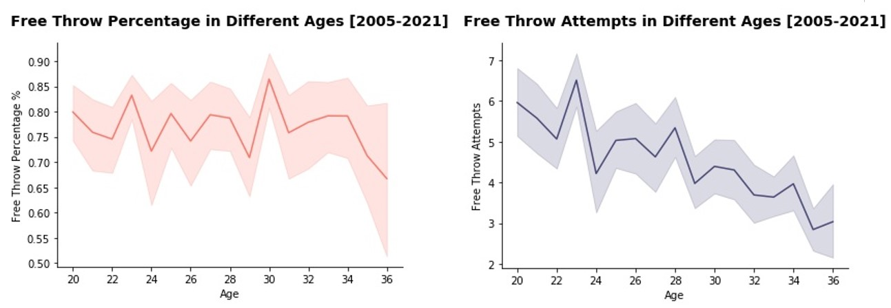
```

Above two graphs show his free throw attempts and percentage in different ages. His career free throw percentage in majority time is quite stable between 70%-80%. However, in the recent season, his free throw percentage has larger variance. Total Free throw attempts had several sharp decreased points, which also fits with his serious injury seasons, such as: 09-10 season Meniscus Tear [24 Years Old], dislocation of acromioclavicular joint [29 Year Old].   

```{r, echo=FALSE}
htmltools::includeHTML("freethrowone.html")
```
As expected, the interactive box-plot shows that Chris Paul tried to get more free throw attempts in the playoffs. In addition, his free throw attempts are similar in terms of game results in PHO, HOU, and LAC, but in other three teams, the game is more likely to win when he made more free throw attempts in the regular season. Another unexpected result is that when he gained more free throw attempts in HOU during playoffs, the game is more likely to lose.  

```{r, echo=FALSE}
htmltools::includeHTML("freethrowtwo.html")
```

The interactive bar plot with a average percentage line shows his free throw percentage against with different opponents. As a stable free throw made players, some patterns can be found. In the playoffs season during recent two seasons, his free throw percentage is not as stable as other seasons. In addition, in the regular season during last four seasons, he would have less free throw percentage when he against with  Washington Wizards, San Antonio Spurs, Sacramento Kings, and Indiana Pacers.

### Assists & Turnovers

```{r, echo=FALSE}
htmltools::includeHTML("assistone.html")
```
Above interactive scatter plot show his great performance in increasing assists and controlling turnovers. In PHO, LAC, and NOH, the slope of OLS trend line is negative both in the playoffs and regular seasons, showing that he can assists more with less turnovers. Only during the playoffs in OKC and the regular season in HOU, the slope of OLS trend line is positive. In addition, it is prominent that he had 0 turnovers with more than 5 assists in many matches. 

```{r, echo=FALSE}
htmltools::includeHTML("assisttwo.html")
```

Above interactive linked brush plot showed the relationship between assists, assists percentage, and turnover percentage. When you select the turnover percentage points that less than 20%, it shows that he can assists 6-14 times in less than 20% turnover percentage in most games. 


## Defense

### Steal & Foul

<iframe frameborder="0" scrolling="no" style="height:700px;width:8000px;border:none;" src='defenseone.html'></iframe>

Above linked interactive plot can help audiences examine the relationship between steal and foul in different teams. The bottom bar chart shows the number of games he played in different teams and audiences can check select specific team separately. For instance, his steals and personal foul are concentrated on 1-3 steals and 2-4 personal fouls based on the map color and circle size. In NOH season, he frequently steals 3 times with 2 fouls, while in LAC season, his fouls increases faster than the number of steals. In addition, in last two seasons, he was good at both controlling his fouls and completing steals.  


### Defensive Rebounds & Offensive Rebounds

<iframe frameborder="0" scrolling="no" style="height:830px;width:8000px;border:none;" src='defensetwo.html'></iframe>

Above linked graphs show his rebounds in different seasons, he gained most rebounds for defensive as expected. The bottom bar chart shows the number of games he played in different teams and audiences can check select specific season separately. Three bar charts have similar trends. In 2008-2009 season, he participated in many games and got the most rebounds totally. Unfortunately, he got serious Meniscus Tear in next season, and he could not play games for a long time and all the stats came to the lowest of his career. In addition, he participated in most games in 2014-2015 seasons of his whole career, and the stats came to peak of the LAC. In HOU, due to the small lineup maybe, he increased offensive rebounds and decreased defensive rebounds. In recent two seasons, he spent more his effort on protecting defensive rebounds rather than getting offensive rebounds.   

## Shot


### Shot Attempts Heatmap

```{r echo=FALSE,out.width='100%'}
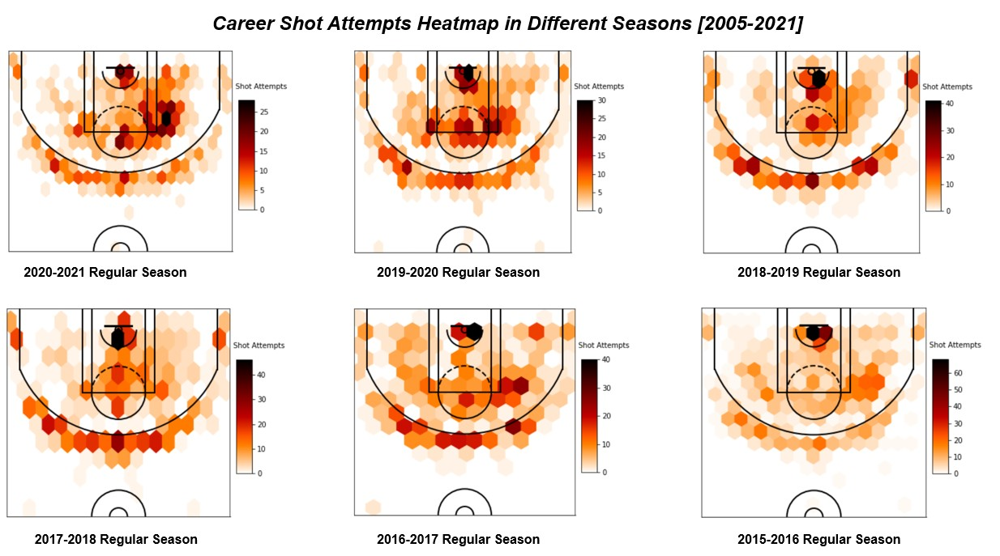
```

```{r echo=FALSE,out.width='100%'}
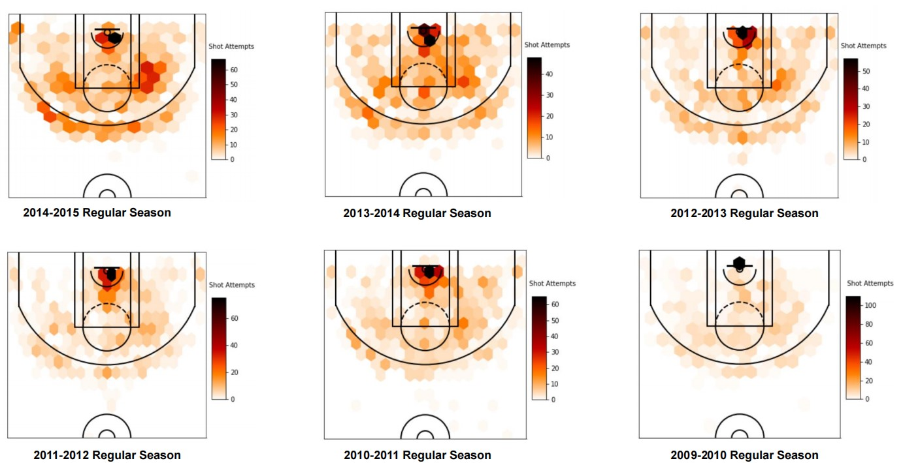
```

```{r echo=FALSE,out.width='100%'}
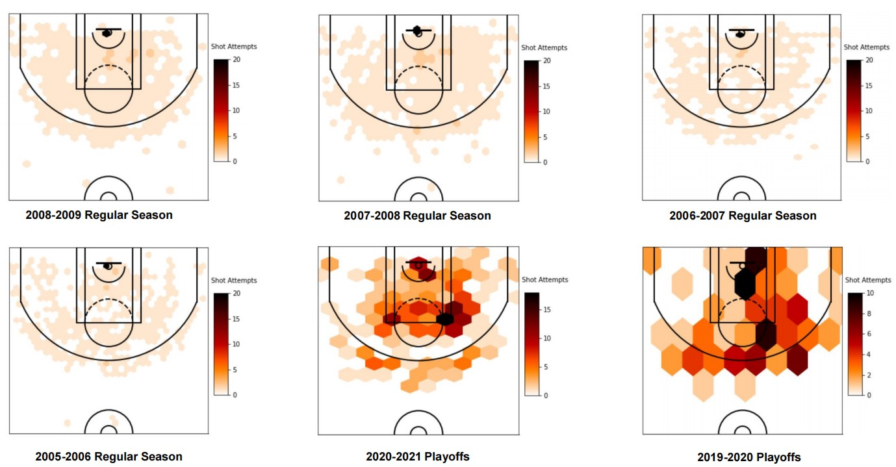
```

```{r echo=FALSE,out.width='100%'}
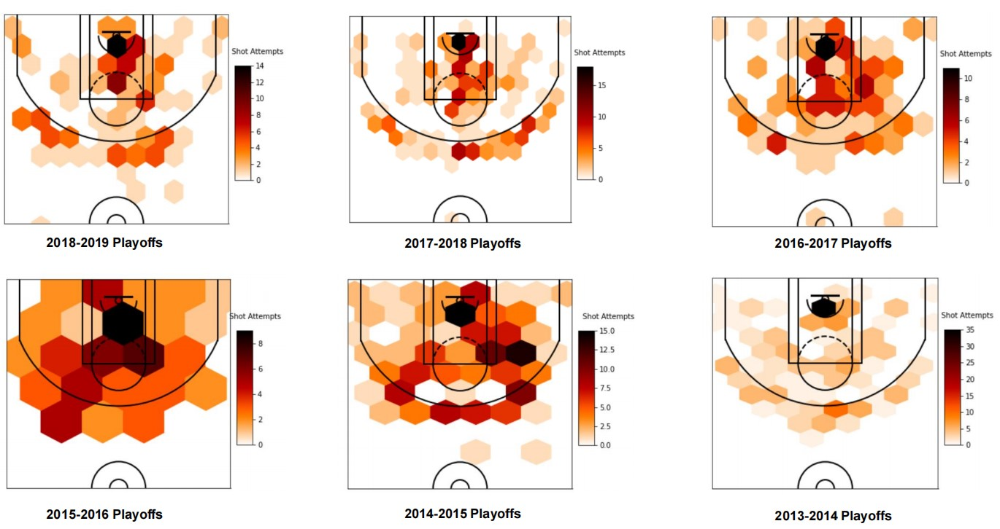
```


```{r echo=FALSE,out.width='100%'}
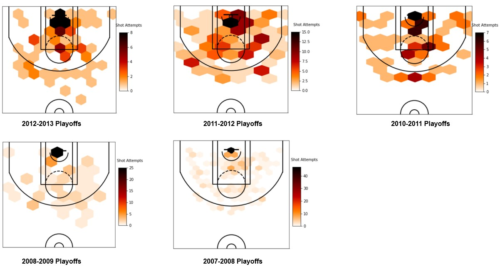
```

Above graphs show the distribution of his career shot attempts. In the regular season, his shot attempts were concentrated on the Restricted Area and Painted Area during the NOK and NOH team period. In LAC, he started extending his shot range and shot more on right elbow and left wing three points until 2015-2016 season. In his last season in LAC, his shot above three-point line are much more uniform and even shot more on right wing and top. In HOU, compared with his previous seasons, he made more three-points attempts on both left and right corner. In addition, instead of shooting on the right elbow, he tended to shot more near the free throw line. In last two seasons in PHO and OKC, he returned to make more two-points attempts on elbow and free throw line area. In addition, he kept his uniform three-point attempts above three-points line. 

In the playoffs, he had similar shot attempts trends as in the regular season. Since 2010-2011 season, shot on right elbow already became his frequent weapon and especially in the 2014-2015 season as well as last two seasons. In addition, the blank area in the two graphs of HOU clearly shows he did not shoot long two-points as before in HOU. 

### Field Goal Percentage VS League Average Heatmap

```{r echo=FALSE,out.width='100%'}
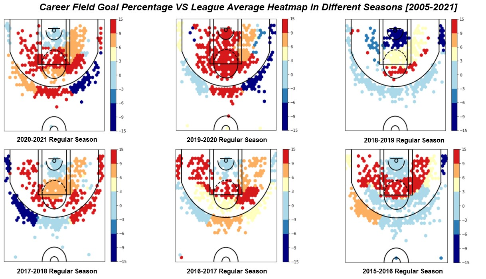
```

```{r echo=FALSE,out.width='100%'}
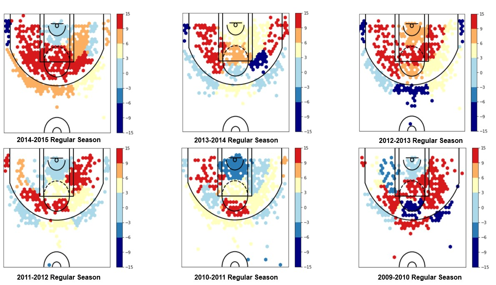
```

```{r echo=FALSE,out.width='100%'}
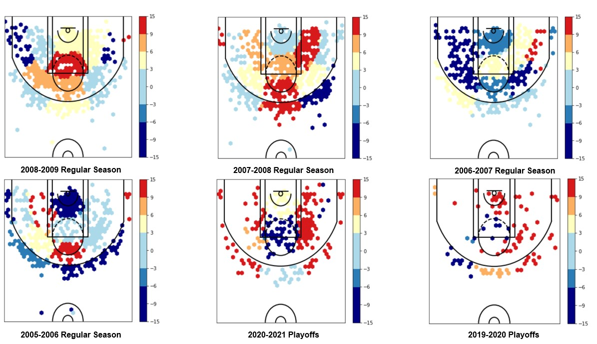
```

```{r echo=FALSE,out.width='100%'}
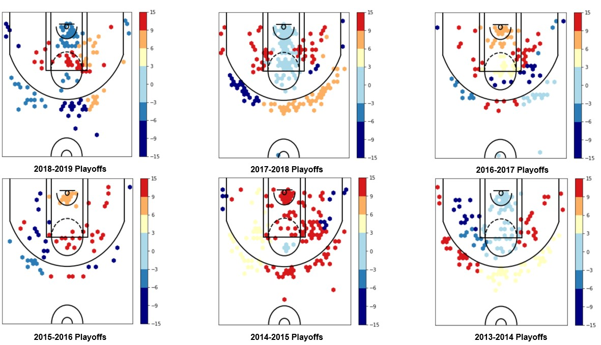
```

```{r echo=FALSE,out.width='100%'}
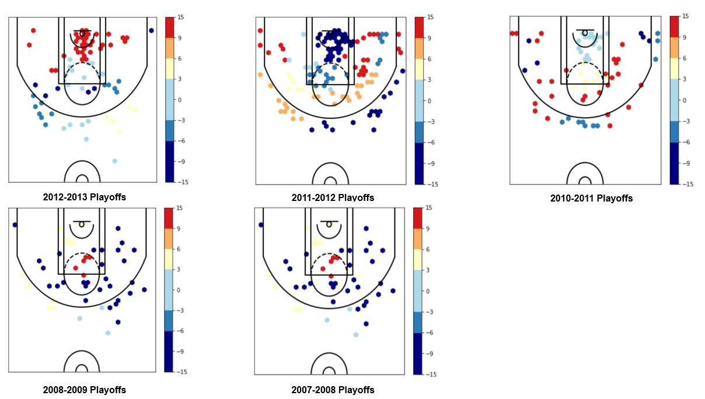
```

Above graph shows the comparison between his field goal percentage and league average in different positions. The cold color represents his field goal percentage is worse than the league average while the warm color represents his field goal percentage is better than the league average.

In the regular season, right elbow is an important position for Chris to kill the game and it became his strong weapon since 2009-2010 seasons, his shooting performance inside the three-points line in the 2012-2013 season is amazing but in next season, his shooting performance is not good as last season, especially in right elbow. After that season, right elbow became his stable and essential weapons. In addition, he had quite poor shooting performance during 2018-2019 season, especially above the three-points line. However, in the last two seasons, his two-points shot became more proficient, especially in both the right and left elbow. In addition, compared with OKC, he improved his left-wing and right corner three-points. 


In the playoffs season, the intensity of the defense will increase and he gradually adapted the playoffs since 2010-2011 seasons. During 2013-2014 playoffs and 2014-2015 playoffs, he clearly improved his three-points shot. In addition, although he had exceptional two-points performance near the elbow area, but also had poor performance near the free throw line both in 2017-2018 season and 2020-2021 season.


## Overall Impact

### Plus/Minus & Box Plus/Minus

```{r, echo=FALSE}
htmltools::includeHTML("plusminusone.html")
```

Above interactive scatter plot shows the relationship between plus/minus and box plus/minus. Plus/minus keeps track of the net changes in the score when a given player is either on or off the court.Box plus/minus estimates of the points per 100 possessions a player contributed above a league-average player, translated to an average team. 

Overall, when the number of games increases, the points tend to be more concentrated on first and third dimensions. Compared with X-axis, Y=0 divide the result into win and lose, especially for the playoffs, reflecting plus/minus is a good indicator to reflect the game result. 

### Offensive Rating & Defensive Rating

```{r out.width='100%'}
logactive$tm_order <- factor(logactive$Tm,levels=c('PHO','OKC','HOU','LAC','NOH','NOK'))

ggplot(logactive,aes(x=Result, y=ORtg, fill=Seasontype)) + 
    geom_boxplot()+facet_wrap(~tm_order)+
  labs(
  title = 'Game Results  VS  Offensive Rating [2005-2021]', 
  x = 'Game Results', y = 'Points Produced per 100 Possessions [Estimated]')+
     theme(axis.text.x = element_text(size = 10),
           panel.grid.major=element_line(colour=NA),
          panel.background = element_rect(fill = "transparent",colour = NA),
          plot.background = element_rect(fill = "transparent",colour = NA),
          plot.title = element_text(color="black", size=10.5, face="bold.italic",
	                                vjust=3, hjust = 0.5),
           axis.title.x = element_text(color="black", size=8, face="bold",vjust=-1),
           axis.title.y = element_text(color="black", size=8, face="bold",vjust=4),
           panel.grid.minor = element_blank())+
  scale_fill_manual(values = c("playoffs" = '#484878',
                                "regular" = '#FC766A'))
```

Above box plot shows that besides playoffs in HOU, higher points produced per 100 possessions, it is more likely to win games as expected, reflecting that he played an important role in offense. In addition, due to defense intensity, normally he would produce less points in the playoffs, but he contributed more points in PHO and NOH.    


```{r out.width='100%'}
logactive$tm_order <- factor(logactive$Tm,levels=c('PHO','OKC','HOU','LAC','NOH','NOK'))

ggplot(logactive,aes(x=Result, y=DRtg, fill=Seasontype)) + 
    geom_boxplot()+facet_wrap(~tm_order)+
  labs(
  title = 'Game Results  VS  Defensive Rating [2005-2021]', 
  x = 'Game Results', y = 'Points Allowed per 100 Possessions [Estimated]')+
     theme(axis.text.x = element_text(size = 10),
           panel.grid.major=element_line(colour=NA),
          panel.background = element_rect(fill = "transparent",colour = NA),
          plot.background = element_rect(fill = "transparent",colour = NA),
          plot.title = element_text(color="black", size=10.5, face="bold.italic",
	                                vjust=3, hjust = 0.5),
           axis.title.x = element_text(color="black", size=8, face="bold",vjust=-1),
           axis.title.y = element_text(color="black", size=8, face="bold",vjust=4),
           panel.grid.minor = element_blank())+
  scale_fill_manual(values = c("playoffs" = '#484878',
                                "regular" = '#FC766A'))

```

Above box plot shows that lower points allowed per 100 possessions, it is more likely to win games as expected, reflecting that he played an important role in defense. In addition, especially in recent four seasons in PHO, OKC, and HOU, he contributed more on defense to win the games compared with regular seasons.  

<iframe frameborder="0" scrolling="no" style="height:300px;width:900px;border:none;" src='plusminustwo.html'></iframe>

Above linked brush scatter plots show the relationship between plus/minus and three other variables including: box plus/minus, offensive rating, and defensive rating. Overall, box plus/minus and offensive rating have positive correlation with plus/minus while defensive rating has negative correlation. In addition, when audiences select the area which defensive rating is smaller than 100, the result of those games are more likely to win.    

# Conclusion

```{r echo=FALSE,out.width='100%'}
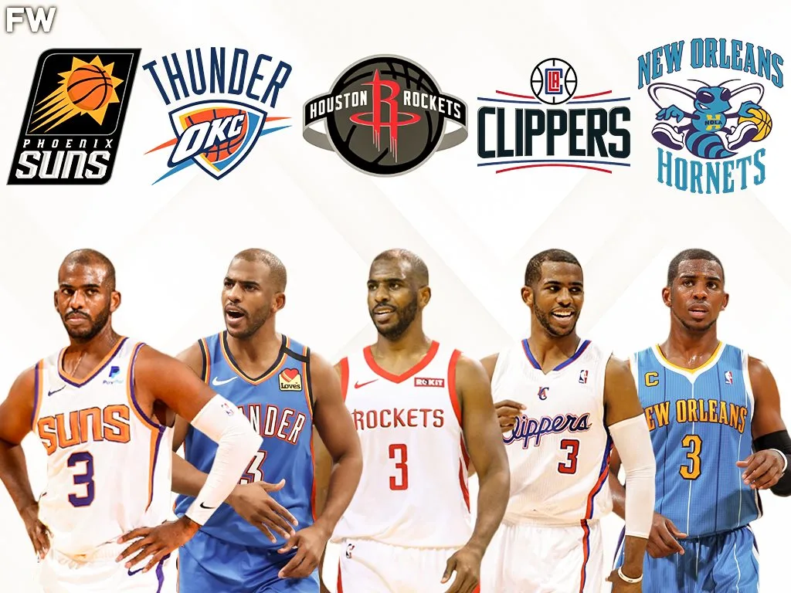
```

## Summary

Overall, the website displays both static and interactive visualizations to show and analyze Chris Paul sixteen seasons stats in four aspects: offense, defense, shot, and overall impact.

1. Offense: In order to win the games, he needed to shot more and got to the free throw line in OKC, NOH, and NOK, especially in the playoffs. Besides in HOU, his kept the field goal percentage at a high level. In recent two season, he became more efficient to make fewer shots but gain more points. As expected, his three-points made and attempts percentage increased since 23 years old and arrived its peak around 33 years old, when he was in Houston Rockets, a team encouraged players to shot three-points. In recent two seasons,  his three-points shot attempts are more concentrated and efficient, especially in Above the Break 3 Area. In addition, he had great performance in increasing assists and controlling turnovers and could assist six-fourteen times in less than 20% turnover percentage in most games. 

2. Defense: He had one-three steals with two-four personal fouls in most games, especially in last two seasons, he was good at both controlling his fouls and completing steals. In addition, he got most his rebounds for defense as expected, especially in recent two seasons, he spent more his effort on protecting defensive rebounds rather than getting offensive rebounds.

3. Shot: He had similar shot attempts trends in the regular season and since 2010-2011 regular season, shot on right elbow already became his frequent weapon and. In HOU, his shot attempts frequent zone extended to three-points line and the area that near free throw line. Compared with league average level, he had amazing shot performance in 2012-2013 regular season and last two seasons, especially both the right and left elbow area are much better than average level. Moreover, he adapted the playoffs defense intensity since 2010-2011 playoffs, and clearly improved his three-points shot during 2013-2014 playoffs and 2014-2015 playoffs.

4. Overall Impact: He played an important role both in offense and defense, especially in recent four seasons, he contributed more on defense to win the games compared with regular seasons. In addition, when his plus/minus points that large than zero and points allowed per 100 possessions that smaller than one hundred, he is more likely to win the games.

## Limitation

1. Compared with offense and shot data, it lacks comprehensive data indexes to analyze defense and overall impact, which also an important factors to analyze his impact on the games.

2. Besides analyzing shot, it only compares his stats in his different periods. It would be better to add other players or league average to comprehensively analyze his impact in the league. 

3. Data visualizations and analytics are amazing tools to assist us to understand and analyze players and games and I am also lucky enough to master those skills to analyze my favorite player. However, if you are fans of sports, you definitely know players are not the same as virtual figure in the computer games, and they have emotion, leadership, and experience, which stats is hard to capture and reflect.    

# Reference

[1] Head photo is originated from [Statmuse](https://www.statmuse.com/nba/player/chris-paul-2857)

[2] Award information is originated from [Land of Basketball](https://www.landofbasketball.com/nba_players/chris_paul.htm)

[3] Bottom Photo is originated from [FADEAWAY WORLD](https://fadeawayworld.net/nba/the-evolution-of-chris-paul-and-how-he-continues-to-make-his-teams-great)

[4] Game log dataset I collected from, [Basketball Reference]( https://www.basketball-reference.com/players/p/paulch01/gamelog/2021)

[5] Shot log detail dataset that is generated from [NBA Stats Api](  https://github.com/swar/nba_api)